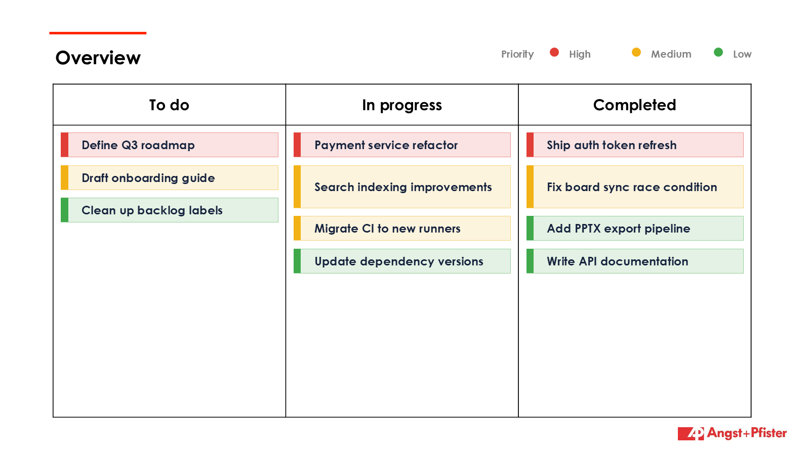

# Trello → PowerPoint Weekly Status

Generate a one-slide PowerPoint **status summary** of a Trello kanban board:

- ✅ **Completed in the last 7 days** — cards moved into the *Done* list, newest first.
- ⭐ **Top priority** — the single most important open (not-yet-Done) card, highlighted.
- 🔴🟡🟢 **Importance colours** — Red / Yellow / Green dots derived from each card's
  Trello labels (label *name* like `High`/`Medium`/`Low`, or label *colour*
  red / orange-yellow / green).

The slide is drawn onto a PowerPoint template (`template.pptx`), so it's easy to
rebrand. A small pure-Python Trello CLI (`trello_integration.py`) is included for
listing boards/lists/cards and creating cards.



## Requirements

- Python 3.10+
- [`python-pptx`](https://python-pptx.readthedocs.io/) — `pip install -r requirements.txt`

## Setup

1. **Install dependencies**

   ```powershell
   pip install -r requirements.txt
   ```

2. **Add your Trello credentials.** Copy the example file and fill in your keys:

   ```powershell
   copy .env.example .env
   ```

   - Get your **API key** (and secret) from <https://trello.com/app-key>.
   - Generate a **member token** by running the auth helper, opening the printed
     URL, authorizing, and pasting the token back into `.env`:

     ```powershell
     python .\trello_integration.py auth-url
     ```

   Your `.env` should end up looking like:

   ```text
   TRELLO_API_KEY=...
   TRELLO_API_SECRET=...
   TRELLO_TOKEN=...
   ```

   > 🔒 **`.env` is git-ignored** and is never committed. Only `.env.example`
   > (placeholders) lives in the repo. Never paste real keys into tracked files.

## Generate the slide

```powershell
# Preview with built-in sample data — no Trello calls, no credentials needed
python .\trello_to_ppt.py --demo

# By exact board name
python .\trello_to_ppt.py "Product Roadmap"

# By board id, with options
python .\trello_to_ppt.py 5f2a9c1b3e4d5a6b7c8d9e0f --days 7 --done-list "Done" -o output\status.pptx
```

The deck is written to `output\board_summary.pptx` by default.

### Options

| Flag | Default | Description |
|------|---------|-------------|
| `board` | – | Trello board **id** or exact **name** (omit only with `--demo`) |
| `--days` | `7` | Look-back window for completed cards |
| `--done-list` | `Done` | Name of the list that means "completed" |
| `--template` | `template.pptx` | Base PowerPoint template to draw onto |
| `--output`, `-o` | `output/board_summary.pptx` | Output path |
| `--max-completed` | `6` | Max completed cards listed before "+N more" |
| `--demo` | – | Render sample data without calling Trello |

### How importance is decided

Each card's level is taken from its Trello **labels** (highest wins):

| Level | Label name contains | Label colour |
|-------|---------------------|--------------|
| 🔴 **High** | high, urgent, critical, blocker, p0, p1 | red |
| 🟡 **Medium** | medium, normal, p2 | orange, yellow |
| 🟢 **Low** | low, minor, trivial, p3, p4 | green, lime |
| ⚪ Unrated | *(no matching label)* | other / none |

To rate your cards, add a label such as **High / Medium / Low** (or use the
red / yellow / green label colours) on your Trello board.

## Customising the look

`template.pptx` is a plain widescreen PowerPoint with no slides — just the theme,
fonts and master. Replace it with any branded `.pptx` (or pass `--template`) and
the status slide inherits its styling. Regenerate the default with:

```powershell
python .\make_template.py
```

## Branded two-slide deck (`overview_deck.py`)

If you already have a branded PowerPoint, `overview_deck.py` builds a deck on top
of it instead of generating from scratch. Provide a **two-slide template**:

1. **Slide 1** — a title slide. Any `DD.MM.YYYY` date on it is refreshed to today
   automatically. The slide is otherwise left untouched.
2. **Slide 2** — an "Overview" slide containing a **3-column table** with headers
   `To do` / `In progress` / `Completed`.

The script fills slide 2 with one textbox per card, and **colours each card's
border by importance** (Red = High, Yellow = Medium, Green = Low — from the same
label rules above). Trello lists are mapped onto the three columns by name
(e.g. `Backlog`/`To Do` → To do, `Doing`/`Review` → In progress, `Done` → Completed).

```powershell
# Preview with sample data (no Trello calls)
python .\overview_deck.py --demo --template your_template.pptx -o output\status_deck.pptx

# Live board
python .\overview_deck.py "My Board" --template your_template.pptx
```

> Your branded `.pptx` template stays **out of git** (only `template.pptx` is
> tracked), so private branding and content are never pushed.

## Trello CLI (optional)

`trello_integration.py` is a dependency-free helper used by the generator and
also usable on its own:

```powershell
python .\trello_integration.py boards                 # list your boards
python .\trello_integration.py lists <board_id>       # list a board's lists
python .\trello_integration.py cards <list_id>        # list a list's cards
python .\trello_integration.py create-card <list_id> "Title" -d "Details"
```

## Project layout

```
trello_integration.py   # Trello REST helpers + standalone CLI
trello_to_ppt.py        # Build the weekly-status slide
make_template.py        # Regenerate template.pptx
template.pptx           # Widescreen base deck (styling only)
requirements.txt        # python-pptx
.env.example            # Credential template (copy to .env)
```
